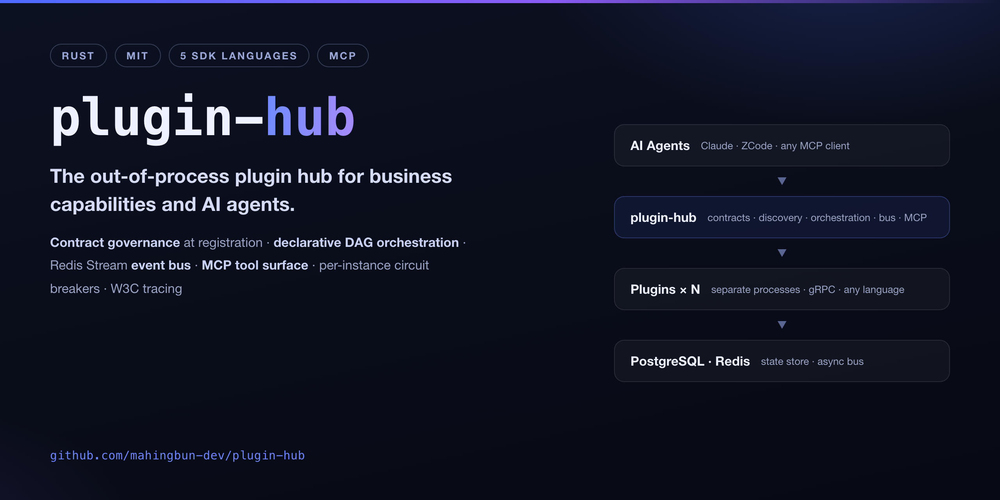
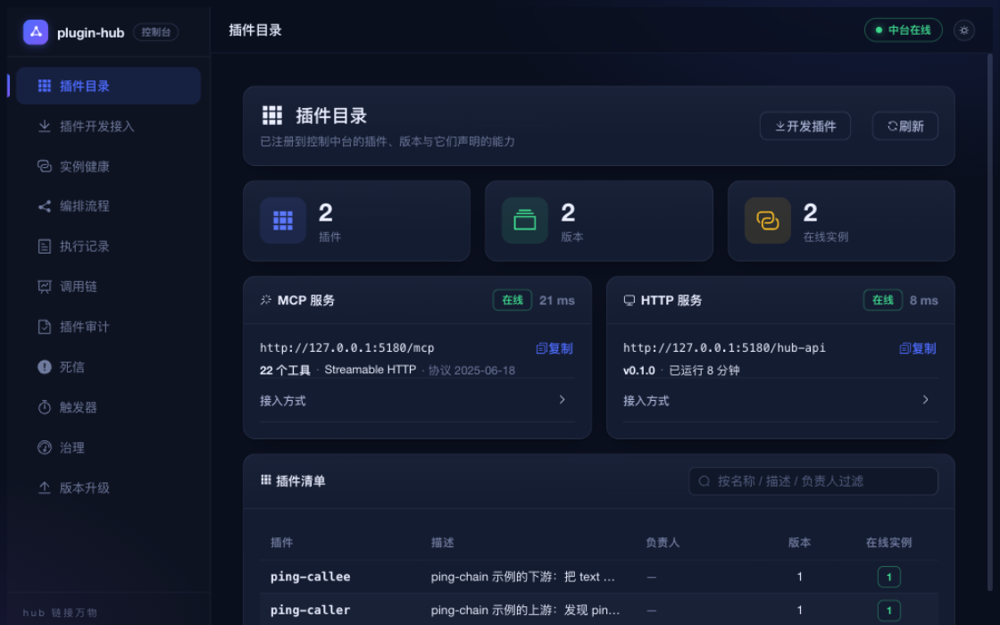

# plugin-hub

English | [简体中文](README.zh-CN.md)

> **The hub that links everything** — a plugin hub in Rust: contract center · registry & discovery · declarative orchestration · event bus · MCP tool surface · [vision](docs/vision.md)



*The web console (ships in this repo): the plugin catalog with live instances and the aggregated MCP tool surface. Thirteen pages — flow editor, trace waterfall, governance — see [Console](#console).*



[](https://github.com/mahingbun-dev/plugin-hub/actions/workflows/ci.yml)
[](https://github.com/mahingbun-dev/plugin-hub/releases/latest)
[](LICENSE)

plugin-hub is the control hub for an out-of-process plugin architecture. The core only provides the "socket" and contains **no business semantics**: every business capability is supplied by a **plugin** — a separate container exposing a gRPC interface, in any language (Go SDK by default). Register and it is usable immediately, with no hub restart.

It targets this class of problem: many business systems need a single access point, contract changes need to be controlled, call chains need to be observable, and AI agents need to reach all of it through MCP — while business code keeps its own deployment, its own stack, and its own release cadence.

## Table of contents

- [Features](#features)
- [Why plugin-hub](#why-plugin-hub)
- [Architecture](#architecture)
- [Core concepts](#core-concepts)
- [Quick start](#quick-start)
- [Agent access (MCP)](#agent-access-mcp)
- [HTTP API reference](#http-api-reference)
- [Plugin development](#plugin-development)
- [Configuration](#configuration)
- [Deployment](#deployment)
- [Operations](#operations)
- [Documentation](#documentation)
- [Repository structure](#repository-structure)
- [Development](#development)

## Features

| Feature | What it means |
|---|---|
| **Field-level contract governance** | Plugins submit a proto descriptor at registration; the hub runs field-level compatibility checks — adding an optional field passes, deleting a field / changing a type / renumbering a tag is rejected. Contract drift is stopped at registration time, not at runtime. |
| **Declarative orchestration** | DAG flows: drag-and-drop wiring in the visual editor, two-phase draft / publish, and mismatched fully-qualified names between upstream and downstream are caught on the spot |
| **Sync + async execution** | Sync chains return per-node results directly; async chains run over the Redis Stream bus with consumer groups, takeover redelivery, dead letters, and idempotency built in |
| **MCP tool surface** | 18 built-in tools; plugin tools aggregate automatically (`plugin__tool`); an agent pulls `tools/list` once and sees every capability |
| **Instance-level governance** | Per-instance concurrency caps, circuit breaking (trip / half-open probing), consecutive-failure counts; when an instance goes offline, its tools disappear from MCP too |
| **End-to-end observability** | W3C trace propagation, spans persisted to the database, optional OTLP export, call-chain waterfall views |
| **Multi-language SDKs** | Go / Python / Node / Rust / C# — five SDKs, scaffold templates one command away, with the SDK sources bundled into the generated project |
| **Pluggable auth** | The hub contains no auth logic; an auth plugin answers "which permission bits does this credential hold", and the hub only recognizes bits |

## Why plugin-hub

| Alternative | What it is | Where it falls short for "unified access + AI dispatch across systems" | When you should still pick it |
|---|---|---|---|
| In-process plugin mechanisms (DI containers, hook registries) | Plugins live inside your service's own process | Shared fate with the host: adding a capability means redeploying the host; a single language stack; contract drift is at best caught in review | One team, one language, a single deployable is all you need |
| API-gateway plugin ecosystems (Kong, APISIX, …) | Plugins extend the gateway's traffic path | Built for the data plane (authn, rate limiting, rewriting); hosting business capabilities and orchestrating across them is not the model | Your extension point really is HTTP traffic |
| One MCP server per system | Each system exposes its own MCP surface | Agents must wire up N surfaces; no cross-system contract enforcement, no unified orchestration or tracing | You have exactly one system |

The trade is explicit: you run one more hub (compose brings PostgreSQL / Redis with it) plus plugins as separate processes, and in exchange you get cross-system contract checks at registration, cross-plugin orchestration, a single aggregated MCP surface, and unified observability.

## Architecture

```
     hub.example.com (TLS) · <host-ip> (direct MCP)        plugins (any host)
                     │                                          │
     ┌───────────────┼───────────────┐                          │
     │ :8081 HTTPS   │ :8096 HTTP    │ :8094 TLS http2          │
     │ console       │ MCP direct    │ plugin gRPC (TLS term.)  │
     │ (same-origin) │               │                          │
     ▼               ▼               ▼                          │
  nginx ──127.0.0.1:8095──▶  plugin-hub  ◀──────── grpc_pass ────┘
                                 │      (forwards to 0.0.0.0:8093)
                  ┌──────────────┴──────────────┐
                  ▼                             ▼
      PostgreSQL (db plugin_hub, :55432)  Redis Stream (db /2, :56380)
```

| Face | Hub listens on | Exposed via | Carries |
|---|---|---|---|
| HTTP face | `127.0.0.1:8095` | nginx `/hub-api/` (same origin as the console), `/mcp` | Ingress / Admin / MCP / health / metrics |
| Plugin face | `0.0.0.0:8093` (gRPC) | nginx `8094 ssl http2` | Registration / heartbeat / callbacks |
| Ops face | unix socket | `hubctl` inside the container | Host-side lifeline |

Design notes:

- **Plugins and the hub do not need to share a machine.** Self-registering plugins report their own reachable address, and the hub **probes reachability at registration** — unreachable addresses are rejected outright, avoiding "registered successfully but never callable".
- **The HTTP face binds loopback only**; everything external goes through nginx: same origin as the console (zero CORS, SSO cookies carried naturally), with TLS and rate limiting consolidated there.
- **Dependencies are bundled**: PostgreSQL and Redis are provisioned by compose (non-default ports, to avoid fights with other services on the same host) — see [Deployment](#deployment).

### Tech stack

| Layer | Choice |
|---|---|
| Hub | Rust: axum + tonic + sqlx + PostgreSQL + redis-rs + tracing + metrics-exporter-prometheus |
| Plugin SDK | Go (default); contracts are protobuf, implementable in any language |
| Console | Vue 3 + Element Plus + Vue Flow (in this repo, `console/`), served statically by nginx |

### Console

The web console lives in this repository ([`console/`](console/) — a standalone Vue 3 + Element Plus + Vue Flow frontend; `pnpm dev` to run, no login needed since the admin face ships without built-in auth; in production it deploys same-origin with the hub's HTTP face, zero CORS). Thirteen pages (eleven menu items plus the flow topology / trace detail reached from the lists):

| Page | Contents |
|---|---|
| Plugin catalog | Plugins / versions / contracts / MCP tools / instances, with contract impact (see both ends before changing a field) |
| Instance health | Registered instances, heartbeat freshness, self-reported addresses (cross-machine plugins recognizable at a glance) |
| Flows + topology | DAG rendering, draft / published / revision history toggles, validation issues marked red on the graph |
| Flow editor | Add nodes, drag wires, node properties, instant local validation, save draft, publish |
| Runs + details | Status / duration / failure reason, per-node duration bars, node-level detail |
| Traces + waterfall | Tree built from `parent_span_id`, indented and time-axis aligned |
| Dead letters | Inspection and replay |
| Triggers | Register, enable/disable, delete cron / MQ triggers |
| Governance | Concurrency usage, breaker state, consecutive failures, cumulative admissions |
| Version upgrades | Find the nodes still pinned to old versions — the operations desk for rolling upgrades |
| Audit / onboarding | Registration rejections & inter-call authorization audit; scaffold template download |

For local setup (database, backend, frontend — full walkthrough), see [console/README.md](console/README.md).

## Core concepts

### The plugin model

Every plugin must provide two parts — neither is optional:

1. **The plugin body** (`Handle`) — the data in/out logic you own;
2. **The data validator** (`Validate`) — data entering the hub passes the validator first; only then does it reach the plugin body.

Plugins declare the messages they consume/produce and their MCP tools in the manifest; the hub uses that for three things: field-level compatibility checks at registration, upstream/downstream message matching validation when flows are saved, and aggregating plugin capabilities into the MCP tool surface.

### Orchestration and execution

- Flows are DAGs with a **two-phase draft / publish** lifecycle: saving a draft is never rejected (it returns `blocked` with `issues` so you can fix them), while publishing re-validates and refuses only on blocking issues — separating "freedom to edit" from "seriousness of taking effect".
- **Sync triggers** return per-node results; **async triggers** enqueue on the bus and return a handle immediately (202). A resident consumer executes them, failures are taken over and redelivered automatically, and deliveries past the limit land in dead letters — inspectable and replayable from the console.

### The MCP tool surface

`POST /mcp`, Streamable HTTP, for agents.

| Category | Tools |
|---|---|
| Plugin catalog | `list_plugins` · `get_plugin` · `list_instances` |
| Troubleshooting | `list_register_rejections` (recent registration rejections: who, why, how many retries) |
| Capability invocation | `invoke_plugin` (payloads pass the plugin validator first; the plugin body only runs after it passes) |
| Orchestration | `list_flows` · `get_flow` · `save_flow_draft` · `trigger_flow` · `trigger_flow_async` |
| Runs and traces | `list_runs` · `get_run` · `list_traces` · `get_trace` |

### Instance-level governance

The governance snapshot provides per-instance concurrency usage, breaker state, consecutive failures, and cumulative admissions. Note the accounting rule: entries are created **once a plugin has been invoked** — freshly registered instances that were never invoked are not in it, and instances that went offline but carry failure counts are kept (otherwise counts would silently reset to zero). To ask "who is online", use `/admin/instances`.

### Admin-face authentication

The hub contains no auth logic by design; plugins carry it. Once `HUB_AUTH_PLUGIN` (a plugin name) is configured, every admin-face request first asks that plugin: **who is this credential, and which permission bits does it hold**. The hub defines the permission bits; the plugin answers "which ones" — who counts as an admin is a matter of your platform's permission system, not something the hub re-implements.

| Permission bit | Governs |
|---|---|
| `hub:read` | Plugin catalog, flow definitions, run records, traces, dead-letter list, trigger list |
| `hub:invoke` | Triggering flows, invoking MCP tools (real side effects) |
| `hub:edit` | Saving drafts, registering triggers (edits to the not-yet-effective copy) |
| `hub:publish` | Publishing (pushing a draft to the version production traffic runs on) |
| `hub:admin` | Governance snapshot, dead-letter replay, trigger deletion |

> Publishing and editing drafts are **two bits**: merging them means every editor can publish.

Three paths are unaffected by auth: `/health` and `/metrics` (whether the hub is alive should not require credentials to answer), `/ingress` (auth is, by design, the plugin's own job), and `/blobs` (an extension of ingress). Two safety baselines: **when the auth plugin is unreachable, return 503 — never degrade to anonymous allow**; and unrecognized paths get a 404 instead of an invented permission bit — turning "typo in the path" into a 403 would hide the real problem.

Implementation notes for auth plugins: implement the standard plugin protocol (`Validate` / `Handle`), read the credential in `Handle`, look up the permission bits, and write them back into the envelope meta. See [docs/plugin-onboarding.md](docs/plugin-onboarding.md) and [examples/ping-chain](examples/ping-chain/).

## Quick start

Prerequisites: Rust stable (see `rust-toolchain.toml`), Docker (for local PostgreSQL / Redis).

**1. Start the hub** (startup is refused if `DATABASE_URL` / `REDIS_URL` is missing; database migrations run automatically at boot):

```bash
DATABASE_URL=postgresql://u:p@127.0.0.1:5432/plugin_hub \
REDIS_URL=redis://127.0.0.1:6379/2 \
HUB_HTTP_PORT=8092 \
cargo run -p hub-server
```

Once it is up, `curl http://127.0.0.1:8092/health` should return `{"ok":true,...}`.

**2. Create your first plugin**:

```bash
cd sdk/go
go run ./cmd/hub-plugin new order-reader --dir /tmp/order-reader
```

The generated project contains the source skeleton, an onboarding guide (including the "four gates" of integration), a contract-consistency test, and the bundled SDK sources — ready to build and run as delivered.

> The first `go mod tidy` needs a Go proxy: `export GOPROXY=https://goproxy.cn,direct`; once resolved, no network is needed afterwards.

**3. Implement two methods and register** (`hubkit.Run` handles the gRPC server, self-registration, heartbeat, self-healing after removal, and graceful shutdown):

```go
func (p *Plugin) Validate(ctx context.Context, env *hubv1.Envelope) (*hubv1.ValidateResponse, error)
func (p *Plugin) Handle(ctx context.Context, env *hubv1.Envelope) (*hubv1.Envelope, error)
```

**4. Call it**:

```bash
curl -X POST http://127.0.0.1:8092/ingress/order-reader \
  -H 'Content-Type: application/json' \
  -d '{"payload": {"order_id": "SO-123"}}'
```

Expected response (200; fields match the hub's `IngressResponse`; `payload` is whatever the plugin's `Handle` returned):

```json
{
  "message_id": "01JBF3Z9X2M5Q7W8R4T6Y8U0VW",
  "trace_id": "4bf92f3577b34da6a3ce929d0e0e4736",
  "traceparent": "00-4bf92f3577b34da6a3ce929d0e0e4736-00f067aa0ba902b7-01",
  "plugin": "order-reader",
  "version": "0.1.0",
  "instance_id": "myhost-4123",
  "elapsed_ms": 9,
  "payload": { "…": "the JSON payload returned by the plugin's Handle" }
}
```

The full onboarding walkthrough is in [docs/plugin-onboarding.md](docs/plugin-onboarding.md); for a runnable example of two plugins discovering and calling each other, see [examples/ping-chain](examples/ping-chain/).

**5. Start the web console (optional)**:

```bash
cd console && pnpm install && pnpm dev
# open http://127.0.0.1:5180/plugins
```

All thirteen pages — plugin catalog, flow editor, trace waterfall, governance, and more — work against the local hub. Database configuration and the full local debugging setup are in [console/README.md](console/README.md).

## Agent access (MCP)

MCP is served over HTTP. For local development connect to `http://127.0.0.1:8092/mcp`; in production via nginx it is `https://hub.example.com/mcp` (same-origin face) or `http://<host-ip>:8096/mcp` (direct-IP face).

Client configuration example (Claude CLI: `claude mcp add --transport http --scope user plugin-hub <url>`; ZCode: `~/.zcode/cli/config.json`):

```json
{ "type": "http", "url": "http://127.0.0.1:8092/mcp" }
```

The server ships DNS-rebinding protection (rmcp Host allowlist). When exposing via nginx you must configure `HUB_MCP_ALLOWED_HOSTS` (**once set it replaces the default loopback allowlist — list loopback explicitly if you still need it**). If you get `403 Forbidden: Host header is not allowed`, add the Host your client uses to the allowlist and restart the container.

## HTTP API reference

**Business data entry** (no auth — auth is the plugins' job):

```
POST /ingress/{plugin}         JSON object payload → wrapped into a google.protobuf.Struct and delivered to the plugin
  { "payload": {...}, "message_id"?: "...", "version"?: "...", "meta"?: {...}, "timeout_ms"?: 30000 }
→ 200 { plugin, version, instance_id, elapsed_ms, payload | payload_type_url + payload_base64 }
→ 422 validator rejected (with issues)    → 404 plugin not registered    → 502 plugin unreachable / timed out
```

> **Large-payload reference channel**: payloads over 4MB are not inlined; the response carries `payload_ref` (uri + sha256 + size) instead, and the envelope the plugin receives contains only the uri. Fetch content back with `GET /blobs/{id}`, TTL-bounded (1 hour by default). The request body hard limit is 8MB — it must exceed the inline cap, otherwise the reference channel could never be reached; over-limit requests are rejected with 413 before the handler runs.

**Admin face** (no built-in hub guard by design; with `HUB_AUTH_PLUGIN` set, auth is the plugin's job):

```
GET  /admin/plugins              plugin list (with version count, live instance count)
GET  /admin/plugins/{name}       plugin detail: per-version contracts, MCP tools, instances
GET  /admin/instances            all live instances
GET  /admin/rejections           recent registration rejections (who, code, reason, retries)
                                 ?plugin=<filter by plugin>&limit=<1..200, default 50>
GET  /admin/messages/{fq_name}   who produces and who consumes a message type (impact check before contract edits)
GET  /admin/governance           instance-level governance snapshot (see "Instance-level governance" for the accounting)
DELETE /admin/plugins/{name}/versions/{version}
                                 delete a registered version (recovery after VERSION_CONFLICT / BREAKING_CHANGE
                                 dead-ends; cascades to contracts, tools, and instances; irreversible;
                                 also clears the plugin's rejection records) — same store path as the
                                 host-face `hubctl remove-version`
GET  /health  GET /metrics       liveness and metrics (does not depend on the database)
```

**Plugin scaffold templates** (no auth — developer material, not runtime data):

```
GET  /plugin-templates                      which language templates exist (with build time, file count, package size)
GET  /plugin-templates/{lang}/download      download a runnable plugin project (zip)
                ?name=<plugin name>&package=<package name, optional>
```

`name` is validated by the same rule as registration (the same function in `hub-registry`), so a name the download page accepts is guaranteed to be accepted at registration. Template contents are embedded into the hub binary at compile time (`crates/hub-templates`).

**Orchestration**:

```
GET  /flows                      flow list: published version, revision count, has-draft flag
GET  /flows/{flow}               flow in full: draft, published version, revision history
POST /flows/{flow}/draft         save draft (saving is never refused; returns blocked with issues)
POST /flows/{flow}/publish       publish (re-validates first; refuses on blocking issues)
POST /flows/{flow}/trigger       sync trigger, returns per-node results
GET  /runs  GET /runs/{run_id}   run records and per-node detail
GET  /traces  GET /traces/{id}   call chains (aggregated per trace, not flattened per span)
```

**Async and the bus**:

```
POST /flows/{flow}/trigger-async enqueue one async execution, returns a handle immediately (202)
GET  /dead-letters               dead-letter list (only not-yet-replayed by default)
GET  /dead-letters/{id}          dead-letter detail
POST /dead-letters/{id}/replay   replay (the caller must supply the payload — dead letters keep only a summary)
GET  /triggers                   trigger list (including disabled ones, disabled first)
POST /flows/{flow}/triggers      register or update a cron / mq trigger
POST /triggers/{id}/enabled      enable / disable
DELETE /triggers/{id}            delete
```

## Plugin development

### SDK overview

**Five: Go / Python / Node / Rust / C#**, under `sdk/<language>/`, each with a scaffold template (what the download endpoint serves). See each SDK's `README.md` for the inventory and usage.

> Plugins that need to **discover and call each other** go through the hub's `PluginGateway` (A→hub→B, never direct): SDK usage, `invokes` permission declarations, and quota / cycle-prevention behavior are in the "Plugin-to-plugin calls and discovery" section of [docs/plugin-onboarding.md](docs/plugin-onboarding.md); the runnable two-plugin example is in [examples/ping-chain](examples/ping-chain/).

Go as the example (the other four align with it):

```bash
cd sdk/go
go run ./cmd/hub-plugin new order-reader --dir /tmp/order-reader
```

`sdk/go/` ships the full six-piece set: server skeleton, contract definitions (generated artifacts are committed — **no protoc needed**), scaffold, mock hub, contract-consistency self-check, and debugging tools. Generated plugins carry JSON payloads in `google.protobuf.Struct`.

### The plugin protocol

Plugins implement `hub.v1.PluginRuntime`: `Describe` / `Validate` / `Handle` / `HandleStream` / `Health`, and self-register with `hub.v1.PluginRegistry` (reporting their reachable address, manifest, and FileDescriptorSet), then heartbeat on the hub-directed schedule. Full definitions in `crates/hub-proto/proto/hub/v1/`.

### Plugin-side conventions

1. **The address reported to the hub must be dialable by the hub** — reachability is probed at registration; unreachable addresses are rejected outright.
2. **Validator first** — the hub always calls `Validate` before `Handle`; on failure the plugin body runs zero times.
3. **Stateless by force** — in-memory instance state is not guaranteed to survive across calls; in exchange, hot swaps are free and horizontal scaling is trivial.
4. **Contracts may not drift** — a manifest and proto under the same version number are immutable; change them by bumping the version.
5. **HubState keys do not contain the version number** — keys are `hub:state:{plugin}:{namespace}:{key}`, so all versions of a plugin share one state space: upgrading does not clear state (exactly what you want for login caches), but two versions writing the same `namespace` overwrite each other; to isolate per version, put the version into the `namespace`.
6. **The subject of `HubState.Publish` is overwritten by the hub** — the envelope's `subject` is unconditionally replaced with the plugin identity (`kind=PLUGIN`, `id=plugin name`); downstream audits and double-confirmations are built on this. `target` currently only accepts **published flow names** (topic subscriptions are not implemented yet). The three gates respond with `accepted: false` + `reason` (**not gRPC errors** — fix your logic, don't retry): **cycle** (this trigger chain already contains the target), **chain too long** (8 hops), **quota** (60 per minute per plugin, isolated per plugin); bus or database failures are the real gRPC errors.

### Adding an SDK language

It is **two things**, of very different sizes:

1. **The mechanism** (small) — create a template directory, add one line to the `build.rs` in `crates/hub-templates`; the hub side, the download endpoint, and the console page follow automatically.
2. **The SDK itself** (large) — an independent mini-project in that language implementing **self-registration, heartbeat, self-healing after removal, and graceful shutdown**; its effort and reliability are accounted separately, not "copy the Go one".

## Configuration

The full list with rationale per item is in [`deploy/.env.example`](deploy/.env.example).

**Core items**:

| Variable | Default | Notes |
|---|---|---|
| `HUB_HTTP_HOST` / `HUB_HTTP_PORT` | `127.0.0.1` / `8095` | HTTP face. Production binds loopback and exposes only via nginx; local development uses `8092` |
| `HUB_GRPC_HOST` / `HUB_GRPC_PORT` | `0.0.0.0` / `8093` | Plugin face. Must bind `0.0.0.0` — plugins may be on other hosts |
| `HUB_MCP_ALLOWED_HOSTS` | empty (loopback only) | MCP Host allowlist, comma-separated; **required** when exposed via nginx. Once set it replaces the default loopback allowlist — list loopback explicitly |
| `HUB_AUTH_PLUGIN` | empty (disabled) | Name of the plugin carrying admin-face auth; prerequisite: the plugin is deployed, otherwise nobody gets into the admin face |
| `PG_PASSWORD` / `REDIS_PASSWORD` | **required** | Composed into the connection strings by compose. **Use plain alphanumerics** (`openssl rand -hex 24`): URL-reserved characters break connection-string parsing, and `$` gets eaten by compose interpolation |
| `OTLP_ENDPOINT` | empty (no export) | Spans are already persisted in PG; export just also pushes them to an external trace backend |

**Runtime tuning** (defaults are sane; adjust after load testing):

| Group | Variables (defaults) |
|---|---|
| Instance governance | `NODE_MAX_CONCURRENCY=32` (fail fast with backpressure at the cap) · `NODE_QUEUE_TIMEOUT_MS=100` · `BREAKER_FAILURE_THRESHOLD=5` · `BREAKER_COOLDOWN_SECS=10` |
| Async bus | `ASYNC_WORKERS=4` · `BUS_MAX_DEPTH=100000` (429 at the cap) · `BUS_MAX_DELIVERY=5` (then dead letter) · `BUS_CLAIM_MIN_IDLE_SECS=60` |
| Retention | `STREAM_RETENTION_HOURS=24` · `SPAN_RETENTION_DAYS=7` · `RUN_RETENTION_DAYS=90` · `AUDIT_RETENTION_DAYS=90` |
| Ops | `LOG_LEVEL=info` · `HUB_OPS_SOCKET=/run/plugin-hub/ops.sock` · `BOOTSTRAP_TOKEN` (first-time provisioning credential; empty = disabled) |

## Deployment

Dependencies are **bundled**: PostgreSQL and Redis are orchestrated by `deploy/docker-compose.yml` and run alongside the hub:

| | Image | Port | Data dir |
|---|---|---|---|
| PostgreSQL | `postgres:16-alpine` | 55432 | `./data/pg` |
| Redis | `redis:7-alpine` | 56380 | `./data/redis` |

Ports deliberately avoid the defaults (no fights with other services on the same host); connection strings are assembled from components by compose, passwords are written in exactly one place (`.env`), and data binds host directories rather than named volumes.

**Minimal launch**:

```bash
git clone https://github.com/mahingbun-dev/plugin-hub && cd plugin-hub
cp deploy/.env.example .env          # at minimum fill PG_PASSWORD / REDIS_PASSWORD
docker compose -p plugin-hub -f deploy/docker-compose.yml --env-file .env up -d
curl http://127.0.0.1:8095/health    # {"ok":true,...}
```

**External exposure** (production shape):

1. **nginx**: merge `deploy/nginx/hub-api-location.conf` into your HTTPS server block (same origin as the console); put `plugin-hub-grpc.conf` (8094, plugin-face TLS termination) and `plugin-hub-ip-mcp.conf` (8096, MCP direct-IP) into `/etc/nginx/conf.d/`, point `server_name` and the cert paths at yours, then `nginx -t && nginx -s reload`.
2. **Cross-machine plugins**: set `HUB_PLUGIN_PUBLIC_ADDR=https://your-domain:8094` in `.env` (the prefix for plugin-reported addresses); the plugin hosts must be able to dial it.

### Backup and restore

[`deploy/backup-pg.sh`](deploy/backup-pg.sh) exports with the container's own `pg_dump` into a backup directory and prunes backups older than `BACKUP_KEEP_DAYS` (default 14). Install it into the host crontab:

```bash
sudo cp deploy/backup-pg.sh /opt/plugin-hub/ && sudo chmod +x /opt/plugin-hub/backup-pg.sh
sudo crontab -e
```

```
PATH=/usr/local/bin:/usr/bin:/bin
17 3 * * * /opt/plugin-hub/backup-pg.sh >> /opt/plugin-hub/backups/backup.log 2>&1
```

> ⚠️ The leading `PATH=` line cannot be dropped: docker usually lives in `/usr/local/bin`, while cron's default PATH is only `/usr/bin:/bin` — without it backups silently disappear and the only trace is one `docker: command not found` line in backup.log. The script also checks for `docker` itself and errors out loud.

**Restore** (backups carry `--clean --if-exists`, i.e. a clobbering restore):

```bash
gunzip -c backups/plugin_hub-YYYYMMDD-HHMMSS.sql.gz \
  | docker exec -i plugin-hub-pg psql -U plugin_hub -d plugin_hub -p 55432
```

> ⚠️ `-p 55432` cannot be dropped: PG sits on a non-default port, so the unix socket is named `.s.PGSQL.55432`, while `psql` looks for the 5432 one by default.

## Operations

### Host-face ops channel

The admin face is fully pluginized by design; this channel is how you get back in when the auth plugin itself breaks:

```bash
docker exec plugin-hub hubctl status
docker exec plugin-hub hubctl list-plugins
docker exec plugin-hub hubctl delete-plugin <name> --yes    # irreversible, explicit confirmation required
```

### Troubleshooting quick reference

| Symptom | Cause and fix |
|---|---|
| `/mcp` returns `403 Forbidden: Host header is not allowed` | Client Host not in `HUB_MCP_ALLOWED_HOSTS`; add it and recreate the container. Note the allowlist replaces the default loopback allowlist once set |
| Plugin registered fine but calls return 502 | Self-reported address unreachable; check the advertise address, container networking, and firewall. If the registration-time reachability probe had failed, it would never have registered |
| Hub fails to start with `invalid port number` | `PG_PASSWORD` contains URL-reserved characters (`/` `#` `?`) that got composed into the connection string; switch to a plain hex password |
| Two plugins kick each other out, half the tool surface missing | Identical `*_INSTANCE_ID` (the default "hostname-PID" always collides on host networking); give every instance a distinct explicit instance_id |
| Plugin container Up but 0 instances, one SDK's tools missing (container logs show `VERSION_CONFLICT` retries every 5s) | Manifest / tool description / input schema changed without bumping `PLUGIN_VERSION` — the same version number must be contract-identical. The right fix is to bump the version and rebuild; as an emergency measure, delete the stale registration with `DELETE /admin/plugins/{name}/versions/{version}` (or `hubctl remove-version`) and let the plugin re-register. Rejection reasons are visible in `GET /admin/rejections` and the MCP tool `list_register_rejections` |
| cron backups silently stopped producing | cron's default PATH cannot find docker; add the `PATH=` first line to the crontab and check backup.log |
| Restore fails with `No such file or directory` | `psql` looks for the 5432 socket by default; add `-p 55432` |
| Go plugin TLS handshake reset on some network paths (curl on the same path works) | A middlebox resets TLS 1.3 handshakes; the SDK provides the `HUB_TLS_MAX_VERSION` escape hatch |
| Go does not trust a self-signed CA on macOS | Go does not read `SSL_CERT_FILE` (it uses the Keychain); for cross-machine tests run a Linux container |

## Documentation

| Document | Contents |
|---|---|
| [docs/vision.md](docs/vision.md) | The vision — "the hub that links everything": design philosophy and the ecosystem map (gates, A2A, hooks, shared context) |
| [docs/design.md](docs/design.md) | Architecture trade-offs, contract design, data model, phased milestones, risks and explicit assumptions |
| [docs/plugin-onboarding.md](docs/plugin-onboarding.md) | The full plugin onboarding flow: four gates, contract consistency, debugging and troubleshooting |
| [deploy/.env.example](deploy/.env.example) | Every environment variable and why |
| `sdk/<language>/README.md` | Each SDK's inventory and usage |

## Repository structure

```
crates/
├── hub-proto/          contract layer: protobuf definitions and generated code (single source of truth)
├── hub-flow/           orchestration DSL, static validation, execution plans
├── hub-contract/       descriptor index and field-level compatibility checks
├── hub-store/          persistence: PostgreSQL + sqlx migrations
├── hub-registry/       registry & discovery: self-registration, heartbeat, removal, instance selection
├── hub-plugin-client/  hub → plugin gRPC client (doubles as the reachability prober)
├── hub-grpc/           plugin → hub gRPC server
├── hub-engine/         orchestration execution: sync chains, async chains, instance governance
├── hub-bus/            Redis Stream bus: consumer groups, takeover redelivery, dead letters, idempotency
├── hub-observe/        span persistence, W3C trace propagation, OTLP export
├── hub-mcp/            MCP Streamable HTTP + plugin tool aggregation
├── hub-ops/            host-face ops channel (unix socket) + hubctl
├── hub-api/            HTTP face: Ingress / Admin / flows / health / metrics
├── hub-core/           configuration and shared base types
├── hub-server/         binary entry point: assembles background tasks and graceful shutdown
├── hub-templates/      plugin scaffold templates (embedded into the binary at compile time)
├── hub-mock/           in-memory mock hub (for SDK tests)
└── hub-testkit/        test fixtures: configurable plugins running on real gRPC
sdk/                    plugin SDKs in Go / Python / Node / Rust / C#
console/                web console demo (Vue 3 + Element Plus + Vue Flow)
examples/ping-chain/    runnable two-plugin call example (caller → hub → callee)
deploy/                 Dockerfile · docker-compose · nginx configs · backup script
docs/                   architecture design and plugin onboarding guide
```

## Development

```bash
cargo build --workspace          # build
cargo test --workspace           # test (needs DATABASE_URL and Redis)
cargo clippy --workspace --all-targets -- -D warnings
cargo fmt --all
```

Integration tests run against **real PostgreSQL and Redis** (Redis uses `db /9`, kept apart from the app's `db /2`); when the dependencies are missing, the affected cases **fail instead of silently skipping** — registration and removal, bus redelivery, and governance concurrency races can only be validated against the real thing. `.cargo/config.toml` carries a `DATABASE_URL` fallback matching this repo's CI convention (local PG container mapped to 55433); prepare it once per the comments and tests run with zero configuration.

## License

Copyright (c) 2026 mahingbun-dev ([github.com/mahingbun-dev](https://github.com/mahingbun-dev)). Released under the [MIT](LICENSE) License.
